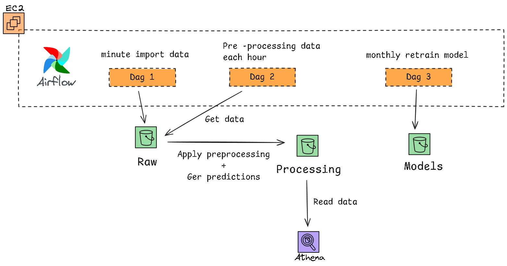
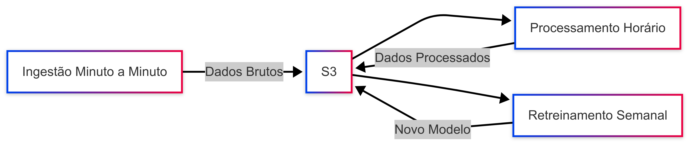
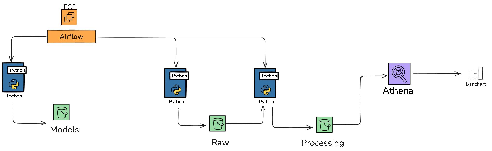
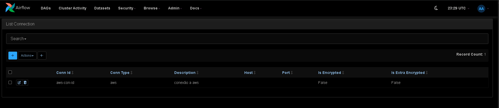
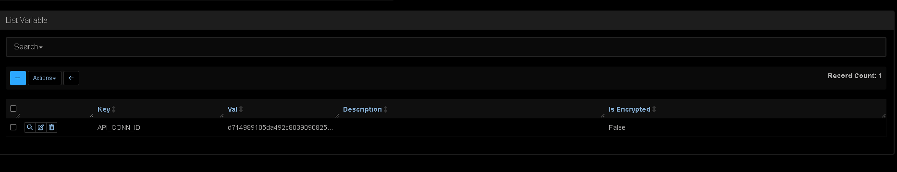

# Tech Challenge - Fase 3

Este repositório contém a solução desenvolvida para o **Tech Challenge da Fase 3**, onde foi proposta a construção de uma pipeline de dados com machine learning, incluindo ingestão, processamento, treinamento e apresentação dos resultados. A atividade integra conhecimentos adquiridos em fases anteriores.

## 📺 Apresentação 

Foi gravado um vídeo explicativo demonstrando todas as etapas do projeto, desde a concepção até a entrega do modelo produtivo. Acesse o vídeo pelo link:

📹 [Link para o vídeo explicativo no YouTube](https://www.youtube.com/watch?v=7zqbxl3CFfU&ab_channel=Sebasti%C3%A3oFerreira)

## 🧠 Visão Geral do Projeto

O projeto foi idealizado a partir de um brainstorm em equipe, que resultou na definição de uma arquitetura baseada em três DAGs utilizando Apache Airflow:




1. **Ingestão em tempo real (minuto a minuto):**
   - Responsável por coletar dados continuamente e armazená-los em um Data Lake (Amazon S3).

2. **Processamento por hora:**
   - Agrega e transforma os dados brutos para alimentar o modelo.
   - Utiliza Amazon Athena para leitura otimizada dos dados no S3.

3. **Re-treinamento do modelo:**
   - Periodicamente reprocessa os dados e re-treina o modelo com base nas novas informações disponíveis.



## 🔧 Arquitetura Técnica

- **Orquestração:** Apache Airflow (implantado via Docker Compose em uma EC2 na AWS)
- **Armazenamento:** Amazon S3 (Data Lake)
- **Consulta e processamento:** Amazon Athena
- **Modelo de Machine Learning:** Support Vector Classifier (SVC)
- **Ambiente de Execução:** Python, scikit-learn, pandas, seaborn, matplotlib
- **Controle de Versão e Documentação:** GitHub
- **Apresentação:** Vídeo com storytelling (link abaixo)



## Escalabilidade e Evolução da Arquitetura

Embora o treinamento de modelos maiores e mais complexos normalmente exija uma infraestrutura robusta, a arquitetura adotada neste projeto foi planejada para suportar a evolução e atender aos requisitos de uso a longo prazo. Com o uso de Apache Airflow, Docker Compose, AWS S3 e Amazon Athena, implementamos uma solução modular e escalável que pode ser adaptada conforme as necessidades futuras, sem comprometer a eficiência operacional.


## 🐳 Airflow com Docker Compose

Utilizamos o Docker Compose para orquestrar o ambiente do Airflow.

> Observação: Ajuste as variáveis de ambiente conforme necessário.

## 🤖 Modelagem Preditiva

Após diversas experimentações, optamos pelo algoritmo Support Vector Classifier (SVC), que apresentou bom desempenho após:

Oversampling: Para tratar o desbalanceamento entre as classes.

Feature Engineering: Criação de novas features a partir das datas e extração de informações relevantes.

## 📦 Estrutura do Repositório

```sh
.
├── airflow
│   ├── dags
│   │   ├── __pycache__
│   │   │   ├── dag_ingestao_weather.cpython-312.pyc
│   │   │   ├── dag_model_retrain.cpython-312.pyc
│   │   │   ├── dag_processamento_wheather.cpython-312.pyc
│   │   │   ├── dag_weather_etl.cpython-312.pyc
│   │   │   └── test-dag.cpython-312.pyc
│   │   ├── dag_ingestao_weather.py
│   │   ├── dag_model_retrain.py
│   │   ├── dag_processamento_wheather.py
│   │   └── include
│   │       ├── __init__.py
│   │       ├── __pycache__
│   │       │   ├── __init__.cpython-312.pyc
│   │       │   ├── ml_utils.cpython-312.pyc
│   │       │   └── weather_utils.cpython-312.pyc
│   │       └── ml_utils.py
│   ├── docker-compose.yaml
│   ├── dockerfile
│   ├── logs
│   ├── plugins
│   ├── requirements.txt
│   └── setup.sh
├── img
│   ├── mermaid_chart.png
│   ├── brain-storm-structure.png
│   └── desenho tecnico.png
├── infrastructure
│   ├── athena.tf
│   ├── backend.tf
│   ├── crawler.tf
│   ├── ec2.tf
│   ├── iam.tf
│   ├── permissions
│   │   ├── Policy_GlueCrawler.json
│   │   ├── Policy_Lambda_decompress_S3.json
│   │   ├── Role_GlueCrawler.json
│   │   └── Role_Lambda_decompress_S3.json
│   ├── provider.tf
│   ├── storage.tf
│   └── variables.tf
└── readme.md
```


## 🚀 Como Executar o Projeto

### Pré-requisitos

- Docker e Docker Compose instalados.
- AWS CLI configurado com acesso ao S3 e Athena (caso deseje replicar o ambiente na AWS).

### Setup do Airflow com Docker Compose

1. Clone o repositório.
2. Navegue até a pasta do projeto.
3. Execute o Docker Compose:

   ```bash
   docker-compose up -d
    ```

É necessário configurar a aws_connection dentro do airflow exemplo:



Para esse projeto deixamos tambem configurada nas secrets do airflow a api_key, deixamos desincryptada para mostrar como ela fica no projeto:



## 🧪 Avaliação e Métricas
O modelo foi avaliado com base em:

- Acurácia

- F1-score

- Matriz de Confusão

Os resultados indicaram boa capacidade de generalização, principalmente após a aplicação do oversampling e do feature engineering.


